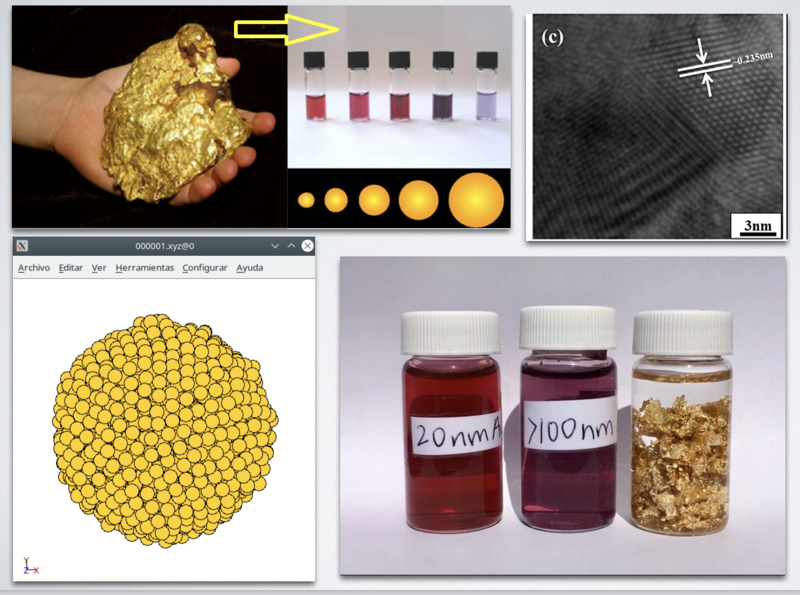

# ANÁLISIS DE DATOS DE ESTRUCTURA INTERNA DE NANOPARTÍCULAS DE ORO: 🌕🌟🌕
[.ipynb](https://github.com/JosefinaCresta/EDA_NanoparticulasAu_TBDS/blob/master/src/EDA.ipynb) || [PDF](https://github.com/JosefinaCresta/EDA_NanoparticulasAu_TBDS/blob/master/EDA_NanoparticulasAu_Memoria.pdf)
 

---

## The Bridge | Digital Talent Accelerator Bootcamp Data Science

## EDA (*Análisis exploratorio de datos*)

###  Josefina Cresta

#### 17 de mayo de 2022

---

### Objetivo

La **nanotecnología** busca innovar y desarrollar nuevos dispositivos de impacto en diferentes áreas, como por ejemplo, en la conversión de energía, almacenamiento de información, administración de fármacos y mejora de la calidad de los procesos médicos. Uno de los principales elementos utilizados es el **oro**, pero no en forma macroscópica como lo conocemos en nuestro día a día, sino a escala nanométrica, donde se manifiestan propiedades únicas de las **nanopartículas**.

La intención del presente trabajo es realizar un **análisis exploratorio de datos** sobre la estructura atómica interna de nanopartículas de oro ya que es un punto crítico para la comprensión de sus propiedades físicas y químicas. Para esto se investiga detalladamente una [base de datos](https://data.csiro.au/collection/csiro:40669) de **4000 nanopartículas de 236 hasta 14277 átomos**, con el objetivo de afirmar la hipótesis de que a pesar que las propiedades de las nanopartículas de oro son considerablemente diferentes a a las propiedades del oro sólido, a partir de ahora oro en bulk, las características estructurales internas de estas dos configuraciones coinciden. 

Específicamente se busca calcular estadísticamente los siguientes valores y se analizan las siguientes correlaciones:
    
- **Longitud media de enlace** entre átomos. Dependencia de la longitud de enlace según la cantidad de átomos que componen la nanopartícula.
- **Número de coordinación** de cada  átomo interno y de cada átomo superficial
- Correlación de la  **energía total** con cantidad de átomos que componen la nanopartícula. Calculo de **energía media por átomo**
- Correlación de energía con coordinación de átomos en bulk y superficiales

---
### Recursos utilizados

1. Lenguaje de programación -> Python 3.9.5

2. Librerias:
     * Numpy: especializada en el cálculo numérico y el análisis de datos, especialmente para un gran volumen de datos.
     * Pandas: especializada en el manejo y análisis de estructuras de datos.
     * Matplotlib y Seaborn:: especializada en la creación de gráficos.
     * Funciones propias: Para análisis estadísticos de normalidad, detección de outliers, cualculo de medias muestrales y correlaciones.
3. Jupyter Nootebook: Para desarrollo de los análisis. [Notebook Pricipal](https://github.com/JosefinaCresta/EDA_NanoparticulasAu_TBDS/blob/master/src/EDA.ipynb)
4. Overleaf LaTex: Para la escritura del informe. [PDF](https://github.com/JosefinaCresta/EDA_NanoparticulasAu_TBDS/blob/master/EDA_NanoparticulasAu_Memoria.pdf)
---
### Presentación
[Slides.com](https://slides.com/joficresta/copy-of-end](https://slides.com/joficresta/copy-of-end)
 
 
 
